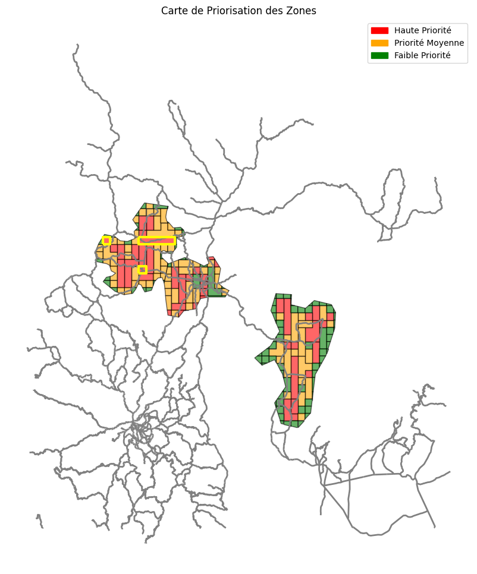

# ETL SIG de Priorisation des Palmiers
## 📖 Description du projet
Ce projet est un **ETL (Extract, Transform, Load) géospatial** conçu pour **analyser et prioriser les zones contenant des palmiers**. Il utilise des couches spatiales (`palmiers`, `routes`, `zones`) pour générer un **score de priorité** pour chaque zone, afin de faciliter la planification et la gestion des interventions.
**Logique principale :**
* Les zones avec **plus de palmiers** et **proches des routes** sont considérées comme prioritaires.
* Le score de priorité est calculé comme suit :


$$
scorepriorite = \frac{nbpalmiers}{distroutemin + 10^{-6}}
$$

* `1e-6` est ajouté pour éviter une division par zéro si une zone touche une route.
---
## 🛠️ Technologies utilisées
* **Python 3**
* **Bibliothèques géospatiales et d’analyse :**
  * `geopandas`, `shapely`, `pyproj`, `geoalchemy2`
* **Analyse de données et visualisation :**
  * `pandas`, `matplotlib`, `seaborn`, `tabulate`
* **Base de données et API :**
  * `sqlalchemy`, `psycopg2-binary`, `requests`, `boto3`
* **Gestion des environnements :**
  * `python-dotenv`
* **Rapports :**
  * `jinja2`, `reportlab`
---
## 📂 Structure du projet
```
projet_priorisation_palmiers/
│
├─ src/                      # Code source ETL
│   ├─ extract.py             # Extraction des données
│   ├─ transform.py           # Transformation et calcul des scores
│   ├─ load.py                # Chargement des résultats et génération de rapports
│   └─ __init__.py
│
├─ data/                     # Couches géospatiales (palmiers, routes, zones)
├─ rapports/                 # Rapports générés
├─ main.py                   # Point d'entrée pour exécuter l'ETL
├─ requirements.txt          # Dépendances Python
└─ README.md                 # Documentation du projet
```
---
## ⚡ Installation
1. **Créer un environnement virtuel :**
```powershell
py -m venv env
```
2. **Définir la politique d’exécution (Windows PowerShell) :**
```powershell
Set-ExecutionPolicy -Scope Process -ExecutionPolicy Bypass
```
3. **Activer l’environnement :**
```powershell
env\Scripts\activate.ps1
```
4. **Installer les dépendances :**
```powershell
pip install -r requirements.txt
```
---
## 🧩 Fonctionnement de l’ETL
1. **Extract**
   * Les fichiers des couches (`palmiers`, `routes`, `zones`) sont chargés depuis plusieurs sources.
## 📥 Sources de données

Le module **Extract** de cet ETL SIG est conçu pour être **flexible** et permet de charger les données géospatiales depuis plusieurs sources : **local**, **Amazon S3** ou **API distante**.

Les couches utilisées sont :
* **Palmiers** (`palmiers.geojson`)
* **Zones de culture** (`zones_cultures.geojson`)
* **Routes** (`highway.geojson`)
Toutes les couches sont automatiquement reprojetées en **UTM 35S (EPSG:32735)** afin de garantir la cohérence spatiale des analyses.
---
### 🔹 Source locale
Les données sont lues directement depuis le dossier `data/` du projet.
**Structure attendue :**
```
data/
├─ palmiers.geojson
├─ zones_cultures.geojson
└─ highway.geojson
```
**Utilisation :**
```python
palmiers, zones, routes = extract_geojson(source="local")
```
---
### 🔹 Source Amazon S3
Les données peuvent être stockées dans un bucket S3.
Le chargement est effectué **directement en mémoire** via `get_object`, sans téléchargement sur disque.
**Prérequis :**
* Identifiants AWS configurés (`AWS_PROFILE` ou variables d’environnement)
* Accès au bucket S3
**Utilisation :**
```python
palmiers, zones, routes = extract_geojson(
    source="s3",
    s3_bucket="mon-bucket-sig",
    s3_prefix="donnees_palmiers"
)
```
---
### 🔹 Source API (GeoJSON distant)
Les couches peuvent être récupérées via des **endpoints HTTP** exposant des fichiers GeoJSON.
**Utilisation :**
```python
palmiers, zones, routes = extract_geojson(
    source="api",
    api_urls={
        "palmiers": "https://api.exemple.com/palmiers.geojson",
        "zones": "https://api.exemple.com/zones.geojson",
        "routes": "https://api.exemple.com/routes.geojson"
    }
)
```
### 🧭 Harmonisation spatiale
Quelle que soit la source des données :
* Toutes les couches sont reprojetées en **EPSG:32735**
* Cela garantit la précision des calculs de distance, de densité et de priorité
---
2. **Transform**
   * Les données sont transformées et enrichies :
     * Calcul du **nombre de palmiers par zone**
     * Calcul de la **distance minimale entre chaque zone et la route la plus proche**
     * Calcul du **score de priorité** avec la fonction :
```python
def compute_priority(zones):
    zones["score_priorite"] = zones["nb_palmiers"] / (zones["dist_route_min"] + 1e-6)
    zone_prioritaire = zones.sort_values("score_priorite", ascending=False).iloc[0]
    return zones, zone_prioritaire
```
3. **Load**
   * Les résultats sont exportés dans le dossier `rapports/` sous forme de fichiers Excel ou PDF.
   * Des visualisations et rapports cartographiques peuvent être générés.
---
## 🚀 Exécution
Pour lancer l’ETL, utiliser le script principal `main.py` :
```bash
python main.py
```
* Les rapports et résultats seront générés automatiquement dans le dossier `rapports/`.
---
## 📊 Alternative d'Analyse PostgreSQL/PostGIS
🗃️ Analyse Directe dans la Base de Données
Le projet inclut une alternative performante : l'analyse directement dans PostgreSQL/PostGIS via le script gisanalysispostgis.py.
## 🎯 Pourquoi cette Alternative ?
Pour les volumes de données importants, exécuter les calculs directement en SQL offre :
✅ Meilleures performances (indexation spatiale)
✅ Moins de transfert de données (tout reste dans la BD)
✅ Intégration facilitée avec d'autres systèmes
✅ Génération automatique de rapports PDF

## 🚀 Fonctionnalités Principales
1. Calcul Intégral en SQL
Toute l'analyse est effectuée dans PostgreSQL :
Calcul des distances palmiers-routes
Agrégation par zone
Calcul du score de priorité
Tri et sélection des zones prioritaires
2. Reporting Automatisé
Génération d'un rapport PDF complet :
Page 1 : Tableau des 10 zones les plus prioritaires
Page 2 : Visualisations (graphique + carte)
Colorisation automatique selon les scores
3. Intégration Cloud
Upload automatique du PDF vers Amazon S3
Structure organisée : outputs/carte/
## 🔄 Complémentarité avec l'ETL
Les deux approches sont complémentaires :
Scénario	Solution Recommandée
Données légères, exploration	ETL Python (main.py)
Gros volumes, production	Analyse SQL (gisanalysispostgis.py)
Pipeline complet	ETL Python + consolidation SQL
---
## 🧪 Tests
Les tests unitaires et d’intégration peuvent être ajoutés dans un futur dossier `tests/`.
Ils permettront de vérifier :
* Le calcul correct des distances
* La bonne attribution du nombre de palmiers par zone
* La génération correcte du score de priorité
---
## 🖼️ Exemple de Résultat

### Carte Prioritaire


## 👤 Auteur

**Gracieux Sikuly|graciersikuly@gmail.com** – Développeur du projet ETL SIG de priorisation des palmiers

## 🤝 Contributions
Les contributions sont les bienvenues !
Merci de soumettre vos **issues** ou **pull requests** pour améliorer le projet.
---
## 📄 Licence
Ce projet est sous licence **MIT**.
